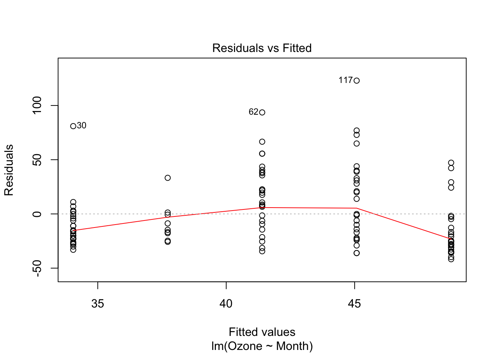

# Objects

## What are Objects?

Objects are, roughly, data (or more generally a stored state) that knows what it can do. 

We know what happens when we put this troublesome `+` guy between numbers


```r
1 + 1 # ud better b sitting down
```

```
## [1] 2
```

But it's less clear what it means to `+` letters


```r
"a" + "b"
```

```
## Error in "a" + "b": non-numeric argument to binary operator
```

Let's see what `typeof` variables `1` and `"a"` are  :

```r
typeof(1)
```

```
## [1] "double"
```

```r
typeof("a")
```

```
## [1] "character"
```
>(note this is a little misleading, `typeof` determines the base object class that an R object is stored as. All R objects are composed of base objects, we'll get to the types of objects in the next section)

R has a useful package `pryr` for inspecting objects and other meta-linguistic needs. Let's get that now.

```r
# install.packages("pryr")
```


### Object terminology
A **class** is the description, or 'blueprint' of how individual **objects** or **instances** are made, including their **attributes** - which data should be kept and what it should be named, and **methods**, the functions that they are capable of calling on their stored data or attributes. Objects can have a nested structure, and sub-classes can **inherit** the attributes and methods of their parent classes.

For example: As a class, trucks have attributes like engine_size, number_of_wheels, or number_of_jumps_gone_off. Trucks have the method go_faster(), but only individual instances of trucks can go_faster() - the concept/class of trucks can't. As a subclass, monster_trucks also have the attributes engine_size, etc. and the method go_faster(), but they also have additional attributes like mythical_backstory and methods like monster_jam().

## Objects in R
>"In R functions are objects and can be manipulated in much the same way as any other object." - *R language guide 2.1.5*

>"S3 objects are functions that call the functions of their objects" - *Also R*

### Object Systems

R has base types and three object-oriented systems (also called **types**). We'll spend more time on Base types and S3 objects in this lesson, and return to S4 and reference classes when we start building bigger code.


* **Base types:** Low-level C types. Build the other object systems.

* **S3 - "Casual objects":** Objects that use **generic functions**. S3 methods "belong to" functions, not classes. Functions contain the **UseMethod("function_name", object)** function (see `?UseMethod`).

* **S4 - "Formal objects":** Formal classes with inheritance and means by which methods can be shared between classes. S4 methods still "belong to" functions, but classes are more rigorously defined. 

* **Reference classes:** Objects that use **message passing** - or the method finally 'belongs to' the class rather than a function.

The easiest way to see everything about an object is to use the str() function, short for structure. For example we can see everything about the lamest linear model ever

```r
lame_model <- lm(c(1,2,3) ~ c(4,5,6))
str(lame_model)
```

```
## List of 12
##  $ coefficients : Named num [1:2] -3 1
##   ..- attr(*, "names")= chr [1:2] "(Intercept)" "c(4, 5, 6)"
##  $ residuals    : Named num [1:3] -9.06e-17 1.81e-16 -9.06e-17
##   ..- attr(*, "names")= chr [1:3] "1" "2" "3"
##  $ effects      : Named num [1:3] -3.46 -1.41 -2.22e-16
##   ..- attr(*, "names")= chr [1:3] "(Intercept)" "c(4, 5, 6)" ""
##  $ rank         : int 2
##  $ fitted.values: Named num [1:3] 1 2 3
##   ..- attr(*, "names")= chr [1:3] "1" "2" "3"
##  $ assign       : int [1:2] 0 1
##  $ qr           :List of 5
##   ..$ qr   : num [1:3, 1:2] -1.732 0.577 0.577 -8.66 -1.414 ...
##   .. ..- attr(*, "dimnames")=List of 2
##   .. .. ..$ : chr [1:3] "1" "2" "3"
##   .. .. ..$ : chr [1:2] "(Intercept)" "c(4, 5, 6)"
##   .. ..- attr(*, "assign")= int [1:2] 0 1
##   ..$ qraux: num [1:2] 1.58 1.26
##   ..$ pivot: int [1:2] 1 2
##   ..$ tol  : num 1e-07
##   ..$ rank : int 2
##   ..- attr(*, "class")= chr "qr"
##  $ df.residual  : int 1
##  $ xlevels      : Named list()
##  $ call         : language lm(formula = c(1, 2, 3) ~ c(4, 5, 6))
##  $ terms        :Classes 'terms', 'formula'  language c(1, 2, 3) ~ c(4, 5, 6)
##   .. ..- attr(*, "variables")= language list(c(1, 2, 3), c(4, 5, 6))
##   .. ..- attr(*, "factors")= int [1:2, 1] 0 1
##   .. .. ..- attr(*, "dimnames")=List of 2
##   .. .. .. ..$ : chr [1:2] "c(1, 2, 3)" "c(4, 5, 6)"
##   .. .. .. ..$ : chr "c(4, 5, 6)"
##   .. ..- attr(*, "term.labels")= chr "c(4, 5, 6)"
##   .. ..- attr(*, "order")= int 1
##   .. ..- attr(*, "intercept")= int 1
##   .. ..- attr(*, "response")= int 1
##   .. ..- attr(*, ".Environment")=<environment: R_GlobalEnv> 
##   .. ..- attr(*, "predvars")= language list(c(1, 2, 3), c(4, 5, 6))
##   .. ..- attr(*, "dataClasses")= Named chr [1:2] "numeric" "numeric"
##   .. .. ..- attr(*, "names")= chr [1:2] "c(1, 2, 3)" "c(4, 5, 6)"
##  $ model        :'data.frame':	3 obs. of  2 variables:
##   ..$ c(1, 2, 3): num [1:3] 1 2 3
##   ..$ c(4, 5, 6): num [1:3] 4 5 6
##   ..- attr(*, "terms")=Classes 'terms', 'formula'  language c(1, 2, 3) ~ c(4, 5, 6)
##   .. .. ..- attr(*, "variables")= language list(c(1, 2, 3), c(4, 5, 6))
##   .. .. ..- attr(*, "factors")= int [1:2, 1] 0 1
##   .. .. .. ..- attr(*, "dimnames")=List of 2
##   .. .. .. .. ..$ : chr [1:2] "c(1, 2, 3)" "c(4, 5, 6)"
##   .. .. .. .. ..$ : chr "c(4, 5, 6)"
##   .. .. ..- attr(*, "term.labels")= chr "c(4, 5, 6)"
##   .. .. ..- attr(*, "order")= int 1
##   .. .. ..- attr(*, "intercept")= int 1
##   .. .. ..- attr(*, "response")= int 1
##   .. .. ..- attr(*, ".Environment")=<environment: R_GlobalEnv> 
##   .. .. ..- attr(*, "predvars")= language list(c(1, 2, 3), c(4, 5, 6))
##   .. .. ..- attr(*, "dataClasses")= Named chr [1:2] "numeric" "numeric"
##   .. .. .. ..- attr(*, "names")= chr [1:2] "c(1, 2, 3)" "c(4, 5, 6)"
##  - attr(*, "class")= chr "lm"
```


We can query any object's base type with pryr's `otype`

```r
pryr::otype(c(1,2,3,4,5)) # A vector is a base object
```

```
## [1] "base"
```

```r
pryr::otype(data.frame(x=c(1,2,3,4,5))) # A dataframe is an S3 object
```

```
## [1] "S3"
```

```r
pryr::otype(lame_model) # as is our lame model.
```

```
## [1] "S3"
```

and its class with `class`

```r
class(c(1,2,3,4,5))
```

```
## [1] "numeric"
```

```r
class(lame_model)
```

```
## [1] "lm"
```


Confusingly, R's object system means that a given object will have both a **class** and a **type**, for example:

```r
pryr::otype(c(1)) # The vector "c(1)" is a base type object
```

```
## [1] "base"
```

```r
class(c(1))       # whose class is 'numeric'
```

```
## [1] "numeric"
```

### Attributes

Object can also have arbitrarily many **attributes**. The most important and common are 

* **`names`** - which give the object the ability to refer to its elements by name. for example:

```r
# We can construct named vectors like this
named_vector <- c("apples"=1, "bananas"=2, "cherries" = 3)
names(named_vector)
```

```
## [1] "apples"   "bananas"  "cherries"
```

```r
named_vector["apples"]
```

```
## apples 
##      1
```

```r
# or this
named_vector <- c(1,2,3)
names(named_vector) <- c("apples", "bananas", "cherries")
```

* **`class`** - which is used by the S3 object system, we'll see that in a moment

* **`dim`** - short for dimensions, which is used by multidimensional base objects. We'll see that in a moment too.

You can query a specific attribute with `attr`

```r
attr(named_vector, "names")
```

```
## [1] "apples"   "bananas"  "cherries"
```

or list all attributes with `attributes`

```r
attributes(named_vector)
```

```
## $names
## [1] "apples"   "bananas"  "cherries"
```


## Base Types
Every R object is built out of basic C structures that define how it is stored and managed in memory.

This table from [Advanced R](http://adv-r.had.co.nz/Data-structures.html#data-structures) summarizes them:

| | Homogenous data | Heterogenous data |
|------------|----------------| ------------------|
| 1-Dimensional | Atomic Vector | List |
| 2-Dimensional | Matrix | Data frame |
| N-Dimensional | Array | |

Recall that we can use `typeof()` to find an object's base type

```r
typeof(1)
```

```
## [1] "double"
```

```r
typeof(list(1,2,3))
```

```
## [1] "list"
```

### Vectors

Vectors are sequences, the most basic data type in R. They have two varieties: **atomic vectors** (with homogenous values) and **lists** (with ... heterogenous values). 

R has no 0-dimensional, scalar types, so individual characters or numbers are length=one atomic vectors. They are:

| Atomic Vector Type | Example | 
| ------------------ | ------- |
| Logical   | `booleans <- c(TRUE, FALSE, NA)` |
| Integer   | `integers <- c(1L, 2L, 3L)`  |
| Double (== `numeric`)    | `doubles <- c(1, 2.5, 0.005)` |
| Character | `characters <- c("apple", "banana")` |

`raw` and `complex` types also exist, but they are rare.

Vectors are constructed with `c()`. When heterogeneous vectors are constructed with `c()`, they are **coerced** to the most permissive vector type (an integer can be both a double (floating point numbers with decimal points) and character "1") - the table above is ordered from least to most permissive.


```r
vect_1 <- c(1L, 2L, 3L)
vect_2 <- c(1L, 2L, 3)
vect_3 <- c(1L,2,"3")

typeof(vect_1)
```

```
## [1] "integer"
```

```r
typeof(vect_2)
```

```
## [1] "double"
```

```r
typeof(vect_3)
```

```
## [1] "character"
```

```r
# We select elements of vectors with [] notation
vect_1[1]
```

```
## [1] 1
```

```r
vect_3[1]
```

```
## [1] "1"
```

Each of the different atomic vector types has different methods (we'll come back to how methods work in a bit), which explains why we can `1 + 1` but not `"1" + "1"`. Notice how the `integer` class has a set of methods called "Arith" (see `?Arith`, an S4 group of generic functions, something we won't talk about until section 5) but `character` doesn't. 

```r
methods(class="integer")
```

```
## [1] as.data.frame
## see '?methods' for accessing help and source code
```

```r
methods(class="character")
```

```
## [1] all.equal                as.data.frame           
## [3] as.Date                  as.POSIXlt              
## [5] as.raster                formula                 
## [7] getDLLRegisteredRoutines
## see '?methods' for accessing help and source code
```

To make a vector that preserves the types of its elements, make a `list` instead

```r
a_list <- list(1L,2,"3")
a_list
```

```
## [[1]]
## [1] 1
## 
## [[2]]
## [1] 2
## 
## [[3]]
## [1] "3"
```

```r
typeof(a_list[[1]])
```

```
## [1] "integer"
```

```r
typeof(a_list[[2]])
```

```
## [1] "double"
```

```r
typeof(a_list[[3]])
```

```
## [1] "character"
```

Notice the double bracket notation `[[]]`. Lists are commonly recursive, ie. they store other lists. Since the elements of our list are themselves lists, single bracket indexing `[]` returns lists, and `[[]]` returns the the elements in that list.


```r
is.recursive(a_list)
```

```
## [1] TRUE
```

```r
a_list[1]
```

```
## [[1]]
## [1] 1
```

```r
typeof(a_list[1])
```

```
## [1] "list"
```

```r
# Indexing recursive lists
b_list <- list(1:3, c("apple", "banana", "cucumber"))
b_list
```

```
## [[1]]
## [1] 1 2 3
## 
## [[2]]
## [1] "apple"    "banana"   "cucumber"
```

```r
b_list[1]    # gets the first list
```

```
## [[1]]
## [1] 1 2 3
```

```r
b_list[1][1] # doesn't work
```

```
## [[1]]
## [1] 1 2 3
```

```r
b_list[[1]]  # gets the contents of the first list
```

```
## [1] 1 2 3
```

```r
b_list[[1]][1] # gets the first element of the contents of the first list
```

```
## [1] 1
```

Similarly to coersion among atomic vectors, vectors that contain lists will be coerced to lists.

```r
c(1,2,3)
```

```
## [1] 1 2 3
```

```r
c(c(1),c(2,3)) # vectors can't be recursive, so they get flattened
```

```
## [1] 1 2 3
```

```r
c(c(1),list(2,3)) # if one element is a list, the whole object will become a list
```

```
## [[1]]
## [1] 1
## 
## [[2]]
## [1] 2
## 
## [[3]]
## [1] 3
```

```r
list(c(1,2,3), c("a","b","c"))
```

```
## [[1]]
## [1] 1 2 3
## 
## [[2]]
## [1] "a" "b" "c"
```

```r
# Unlist turns lists back into (flat) atomic vectors
unlist(list(c(1,2,3), c("a","b","c")))
```

```
## [1] "1" "2" "3" "a" "b" "c"
```

Because they are the most general form of vector, lists are used as the base type for many derived classes, like data frames

```r
typeof(data.frame(c(1,2,3)))
```

```
## [1] "list"
```

### Matrices & Arrays
**Arrays** are atomic vectors with a `dim` attribute. **Matrices** are arrays with `dim = 2`. 


```r
# General way of making arrays
array_1 <- array(1:24, dim=c(2,3,4))
array_1
```

```
## , , 1
## 
##      [,1] [,2] [,3]
## [1,]    1    3    5
## [2,]    2    4    6
## 
## , , 2
## 
##      [,1] [,2] [,3]
## [1,]    7    9   11
## [2,]    8   10   12
## 
## , , 3
## 
##      [,1] [,2] [,3]
## [1,]   13   15   17
## [2,]   14   16   18
## 
## , , 4
## 
##      [,1] [,2] [,3]
## [1,]   19   21   23
## [2,]   20   22   24
```

```r
typeof(array_1)
```

```
## [1] "integer"
```

```r
attributes(array_1)
```

```
## $dim
## [1] 2 3 4
```

```r
# Matrices have their own syntax
array_2 <- matrix(1:24, ncol=3, nrow=8)
array_2
```

```
##      [,1] [,2] [,3]
## [1,]    1    9   17
## [2,]    2   10   18
## [3,]    3   11   19
## [4,]    4   12   20
## [5,]    5   13   21
## [6,]    6   14   22
## [7,]    7   15   23
## [8,]    8   16   24
```

```r
# A vector can be made an array afterwards by setting the 'dim' attribute
array_3 <- c(1:24)
dim(array_3) <- c(2,3,4)
# or attr(array_3, "dim") <- c(2,3,4)
array_3
```

```
## , , 1
## 
##      [,1] [,2] [,3]
## [1,]    1    3    5
## [2,]    2    4    6
## 
## , , 2
## 
##      [,1] [,2] [,3]
## [1,]    7    9   11
## [2,]    8   10   12
## 
## , , 3
## 
##      [,1] [,2] [,3]
## [1,]   13   15   17
## [2,]   14   16   18
## 
## , , 4
## 
##      [,1] [,2] [,3]
## [1,]   19   21   23
## [2,]   20   22   24
```

In higher dimensions, c() becomes `cbind(), rbind()`, and `abind()`; column and row bind for matrices and array bind for arrays.

```r
by_columns <- cbind(c(1,2,3), c(4,5,6), c(7,8,9))
by_columns
```

```
##      [,1] [,2] [,3]
## [1,]    1    4    7
## [2,]    2    5    8
## [3,]    3    6    9
```

```r
by_rows <- rbind(c(1,2,3), c(4,5,6), c(7,8,9))
by_rows
```

```
##      [,1] [,2] [,3]
## [1,]    1    2    3
## [2,]    4    5    6
## [3,]    7    8    9
```

```r
abind::abind(by_columns, by_rows, along=1)
```

```
##      [,1] [,2] [,3]
## [1,]    1    4    7
## [2,]    2    5    8
## [3,]    3    6    9
## [4,]    1    2    3
## [5,]    4    5    6
## [6,]    7    8    9
```

```r
abind::abind(by_columns, by_rows, along=2)
```

```
##      [,1] [,2] [,3] [,4] [,5] [,6]
## [1,]    1    4    7    1    2    3
## [2,]    2    5    8    4    5    6
## [3,]    3    6    9    7    8    9
```

```r
abind::abind(by_columns, by_rows, along=3)
```

```
## , , 1
## 
##      [,1] [,2] [,3]
## [1,]    1    4    7
## [2,]    2    5    8
## [3,]    3    6    9
## 
## , , 2
## 
##      [,1] [,2] [,3]
## [1,]    1    2    3
## [2,]    4    5    6
## [3,]    7    8    9
```

Arrays and matrices also have new methods that lists and vectors dont.

```r
methods(class="list")
```

```
## [1] all.equal     as.data.frame relist        within       
## see '?methods' for accessing help and source code
```

```r
methods(class="matrix")
```

```
##  [1] anyDuplicated as.data.frame as.raster     boxplot       determinant  
##  [6] duplicated    edit          head          isSymmetric   relist       
## [11] subset        summary       tail          unique       
## see '?methods' for accessing help and source code
```

### Data Frames
Data frames are one of the gems of R. A data frame is a list of equal length vectors. 


```r
df <- data.frame(little_ones = c(0,1,2,3,4),
                 big_ones = c(5,6,7,8,9))
df
```

```
##   little_ones big_ones
## 1           0        5
## 2           1        6
## 3           2        7
## 4           3        8
## 5           4        9
```

```r
attributes(df)
```

```
## $names
## [1] "little_ones" "big_ones"   
## 
## $row.names
## [1] 1 2 3 4 5
## 
## $class
## [1] "data.frame"
```

data frames can be used like lists of vectors

```r
df[1]
```

```
##   little_ones
## 1           0
## 2           1
## 3           2
## 4           3
## 5           4
```

```r
df[[1]]
```

```
## [1] 0 1 2 3 4
```

```r
df[[1]][1] # as above
```

```
## [1] 0
```

Or using `names` with the `$` operator (see `?Extract` for more information).


```r
names(df)
```

```
## [1] "little_ones" "big_ones"
```

```r
colnames(df)
```

```
## [1] "little_ones" "big_ones"
```

```r
rownames(df)
```

```
## [1] "1" "2" "3" "4" "5"
```

```r
df$little_ones 
```

```
## [1] 0 1 2 3 4
```

```r
df$big_ones
```

```
## [1] 5 6 7 8 9
```

Data frames also inherit the methods of lists and vectors


```r
df2 <- data.frame(medium_ones = c(3,4,5,6,7))
cbind(df, df2)
```

```
##   little_ones big_ones medium_ones
## 1           0        5           3
## 2           1        6           4
## 3           2        7           5
## 4           3        8           6
## 5           4        9           7
```

```r
df_squared <- cbind(df2, df2)
names(df_squared) <- names(df)
rbind(df,df_squared)
```

```
##    little_ones big_ones
## 1            0        5
## 2            1        6
## 3            2        7
## 4            3        8
## 5            4        9
## 6            3        3
## 7            4        4
## 8            5        5
## 9            6        6
## 10           7        7
```


### Etc.

Functions, environments, and other stuff that we'll learn about in our section on Functions are also base objects, but we'll discuss them then.


## S3 Objects
S3 objects "belong to" functions, which become their methods. S3 classes don't really "exist," but are assigned as an object's "class" attribute. S3 classes are one of the worst things about R, but are also responsible for some of its flexibility.


```r
x <- 1
attr(x, "class")
```

```
## NULL
```

```r
class(x) <- "letters"
attr(x, "class")
```

```
## [1] "letters"
```

One can find an articulation of the reasoning behind this "function-and-class" programming can be found here: https://developer.r-project.org/howMethodsWork.pdf. We'll talk more about this in later sections.


S3 objects are defined by a series of functions that themselves contain the `UseMethod()` function - this is described briefly above, try `?UseMethod` for more detail. These functions extend the generic function, typically using the syntax `generic.class()` as in the case of `mean.Date()` for taking the mean of dates. One can list the objects that have a generic method, and the methods that an object has with `methods()`


```r
methods(mean) # list the classes that have this method
```

```
## [1] mean.Date     mean.default  mean.difftime mean.POSIXct  mean.POSIXlt 
## see '?methods' for accessing help and source code
```

```r
methods(class="Date") # list the methods that this class has
```

```
##  [1] -             [             [[            [<-           +            
##  [6] as.character  as.data.frame as.list       as.POSIXct    as.POSIXlt   
## [11] Axis          c             cut           diff          format       
## [16] hist          is.numeric    julian        Math          mean         
## [21] months        Ops           pretty        print         quarters     
## [26] rep           round         seq           split         str          
## [31] summary       Summary       trunc         weekdays      weighted.mean
## [36] xtfrm        
## see '?methods' for accessing help and source code
```

By default, the source code of S3 methods is not visible to R, one can retreive it with `utils::getS3method``

The `plot` base function is an s3 generic method.

```r
pryr::ftype(plot) # get a function's type
```

```
## [1] "s3"      "generic"
```

By default, if the first argument is a base type compatible with being points on a scatterplot, the actual function that is called is `plot.default`, whose source behaves like you'd expect:


```r
plot.default
```

```
## function (x, y = NULL, type = "p", xlim = NULL, ylim = NULL, 
##     log = "", main = NULL, sub = NULL, xlab = NULL, ylab = NULL, 
##     ann = par("ann"), axes = TRUE, frame.plot = axes, panel.first = NULL, 
##     panel.last = NULL, asp = NA, ...) 
## {
##     localAxis <- function(..., col, bg, pch, cex, lty, lwd) Axis(...)
##     localBox <- function(..., col, bg, pch, cex, lty, lwd) box(...)
##     localWindow <- function(..., col, bg, pch, cex, lty, lwd) plot.window(...)
##     localTitle <- function(..., col, bg, pch, cex, lty, lwd) title(...)
##     xlabel <- if (!missing(x)) 
##         deparse(substitute(x))
##     ylabel <- if (!missing(y)) 
##         deparse(substitute(y))
##     xy <- xy.coords(x, y, xlabel, ylabel, log)
##     xlab <- if (is.null(xlab)) 
##         xy$xlab
##     else xlab
##     ylab <- if (is.null(ylab)) 
##         xy$ylab
##     else ylab
##     xlim <- if (is.null(xlim)) 
##         range(xy$x[is.finite(xy$x)])
##     else xlim
##     ylim <- if (is.null(ylim)) 
##         range(xy$y[is.finite(xy$y)])
##     else ylim
##     dev.hold()
##     on.exit(dev.flush())
##     plot.new()
##     localWindow(xlim, ylim, log, asp, ...)
##     panel.first
##     plot.xy(xy, type, ...)
##     panel.last
##     if (axes) {
##         localAxis(if (is.null(y)) 
##             xy$x
##         else x, side = 1, ...)
##         localAxis(if (is.null(y)) 
##             x
##         else y, side = 2, ...)
##     }
##     if (frame.plot) 
##         localBox(...)
##     if (ann) 
##         localTitle(main = main, sub = sub, xlab = xlab, ylab = ylab, 
##             ...)
##     invisible()
## }
## <bytecode: 0x7ff2f0f26a28>
## <environment: namespace:graphics>
```

If the first argument to `plot` has its own `plot` method (ie. that it is exported by the object's package namespace, more about this in section 5), that function is called instead. That's why 


```r
aq <- datasets::airquality
plot(lm(Ozone ~ Month, data=aq))
```



is different than this nonsensical model


```r
plot(lme4::lmer(Ozone ~ 0 + (Day | Month), data=aq))
```


### Example: Extending S3 Objects
> http://adv-r.had.co.nz/OO-essentials.html "Creating new methods and generics"

Using a class's method is what allows us to do sensible computations on different types of objects with the same command.


```r
pryr::ftype(mean) # mean is an s3 generic function
```

```
## [1] "s3"      "generic"
```

```r
x <- 1
class(x) <- "just_one"

# We give our "just_one" class a mean method:
mean.just_one <- function(x, ...) print("that's just a one you maniac")

# Mean behaves like it should for numbers and lists of numbers
mean(1)
```

```
## [1] 1
```

```r
mean(c(1,1.5))
```

```
## [1] 1.25
```

```r
mean(x) # Even though "x" is just 1, because we have given it a "class" attribute it calls mean.just_one rather than mean.default
```

```
## [1] "that's just a one you maniac"
```

```r
# Other objects have their own mean() method
methods(mean)
```

```
##  [1] mean,ANY-method          mean,Matrix-method      
##  [3] mean,sparseMatrix-method mean,sparseVector-method
##  [5] mean.Date                mean.default            
##  [7] mean.difftime            mean.just_one           
##  [9] mean.POSIXct             mean.POSIXlt            
## see '?methods' for accessing help and source code
```

```r
# like Date objects
dates <- c("01jan2000","15jan2000")
attr(dates,"class")
```

```
## NULL
```

```r
mean(dates) # Don't work
```

```
## Warning in mean.default(dates): argument is not numeric or logical:
## returning NA
```

```
## [1] NA
```

```r
# turn it into "Date" object
dates <- as.Date(dates, "%d%b%Y") # base has a set of "as" methods to convert types
attr(dates,"class")
```

```
## [1] "Date"
```

```r
mean(dates) # will call its method
```

```
## [1] "2000-01-08"
```

```r
mean.Date(dates) # which can also be called directly
```

```
## [1] "2000-01-08"
```


## S4 Objects
S4 objects have a single class definition with specifically defined fields and functions. They are too complicated for us to cover in much detail yet, so we will return to them again later.

We could pretend for awhile we're another class with S3 objects


```r
a <- data.frame(a="test")
class(a)
```

```
## [1] "data.frame"
```

```r
class(a) <- "lm"
a
```

```
## 
## Call:
## NULL
## 
## No coefficients
```

```r
summary(a)
```

```
## Error in if (p == 0) {: argument is of length zero
```

Not so with S4 objects.

We can finally implement our truck classes

```r
setClass("truck",
  slots = list(engine_size = "numeric",
    n_wheels = "numeric",
    n_jumps  = "numeric"))
  
setClass("monster_truck",
  slots = list(mythical_backstory = "character"),
  contains = "truck")
  
getClass("monster_truck")
```

S4 objects have `slots`, accessible with `@` (which behaves like `$`) or `slot()`. We create new instances of S4 objects with `new()`


```r
my_truck <- new("truck", engine_size = 4, n_wheels = 4, n_jumps = 40)

my_truck@engine_size
slot(my_truck, "n_jumps")
```

S4 Methods are a headache (and we will skip them in the class). One has to create a generic function if it does not yet exist with `setGeneric()`, then set the method, classes and function separately with `setMethod()`. An example for your edification:


```r
setGeneric("go_faster", function(which_truck, how_fast) {standardGeneric("go_faster")})

setMethod("go_faster",
  signature = c(which_truck = "truck",
    how_fast = "character"),
  function(which_truck, how_fast){
    print("your truck is now going:")
    print(how_fast)
    print("in MPH:")
    print(which_truck@engine_size * 4)
  }
)

go_faster(my_truck, "2 fast 4 u 2 c")
```

Try extending that to have the monster trucks tell their mythical_backstory as they accelerate.

We will return to S4 objects in more detail in section 5.

## Reference Classes

References classes are a "truly" object oriented system in R, but we are going to skip them entirely for now because they are rare enough that you aren't likely to encounter them yet. See here for more information: http://adv-r.had.co.nz/OO-essentials.html#rc

## References
* http://manuals.bioinformatics.ucr.edu/home/programming-in-r#TOC-Object-Oriented-Programming-OOP-
* http://www.stat.ucla.edu/%7Ecocteau/stat202a/resources/docs/S4Objects.pdf
* http://adv-r.had.co.nz/OO-essentials.html
* http://adv-r.had.co.nz/Data-structures.html


-------------------


